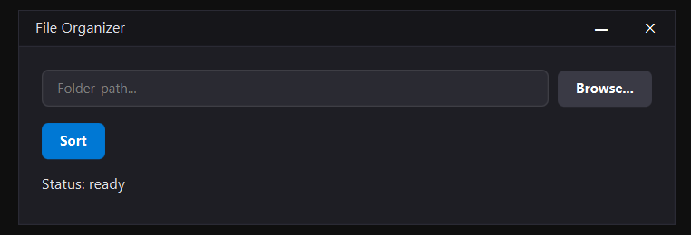

# 📁 File Organizer

A Java desktop application that automatically sorts files in a folder into subfolders based on their file extension.

---

## ⚠️ Disclaimer

Use at your own risk. This application moves and reorganizes files on your local system. While it includes built-in conflict resolution, the author is not responsible for any accidental data loss, misplaced files, or system errors. Always ensure you have a backup of important data before running the organizer on critical folders.

---

## Contact

**nomoon - Johannes**
- GitHub: [@Johannes67835](https://github.com/johannes67835)
- Email: contact@nomoon.org.uk

---

## Features

- Automatic sorting by file type (images, documents, videos, music, archives, code, ...)
- Dark UI with modern JavaFX styling
- Folder selection via browse dialog
- Automatic conflict resolution (`file_1.pdf`, `file_2.pdf`, ...)
- Real-time statistics: moved files, unknown types, errors
- Internationalization support via ResourceBundle

---

## Requirements

| Dependency         | Version | 
|--------------------|---------| 
| Windows (for .exe) | 10, 11  |
| for other OS's     |         |
| JDK                | 21 LTS  |
| JavaFX SDK         | 21.0.11 |
| IntelliJ IDEA      | any     |

---

## Languages

| Region        | Languages                                                                                |
|---------------|------------------------------------------------------------------------------------------|
| International | English                                                                                  |
| Europe        | German, Dutch, Spanish, French, Italian, Polish, Romanian, Russian, Slovenian, Ukrainian |
| Asia          | Hindi, Japanese, Simplified Chinese                                                      |
| Americas      | Portuguese (Brazil)                                                                      | 

---

## Setup

1. Download <a href="https://download.nomoon.org.uk/FileSorter-v1.0Setup.exe">the installer</a>
2. Launch it
3. Press "yes" on the Administrator prompt
4. Follow the instructions given by the Installer

---

## Usage

1. Launch the application from your desktop or start menu.
2. Click "Browse" to select the target directory you want to clean up.
3. Click "Sort" and watch your files move into sorted folders instantly.

---

## Supported file types

| Extensions | Target folder |
|------------|---------------|
| `.jpg` `.jpeg` `.png` `.gif` `.bmp` `.svg` `.webp` | Images |
| `.pdf` `.doc` `.docx` `.txt` `.odt` `.rtf` `.md` | Documents |
| `.xls` `.xlsx` `.csv` `.ods` | Spreadsheets |
| `.ppt` `.pptx` `.odp` | Presentations |
| `.mp4` `.mkv` `.avi` `.mov` `.wmv` `.flv` | Videos |
| `.mp3` `.wav` `.flac` `.aac` `.ogg` `.m4a` | Music |
| `.zip` `.rar` `.7z` `.tar` `.gz` | Archives |
| `.java` `.py` `.js` `.html` `.css` `.json` `.sql` | Code |
| `.exe` `.msi` `.jar` `.bat` `.sh` | Programs |
| (everything else) | Other |

---

## Technologies

- **Java 21** with NIO.2 API (`java.nio.file`)
- **JavaFX 21** for the GUI
- **ResourceBundle** for internationalization

---

## License

Open Source - free to use

---

_**readme partly enhanced with ai_
